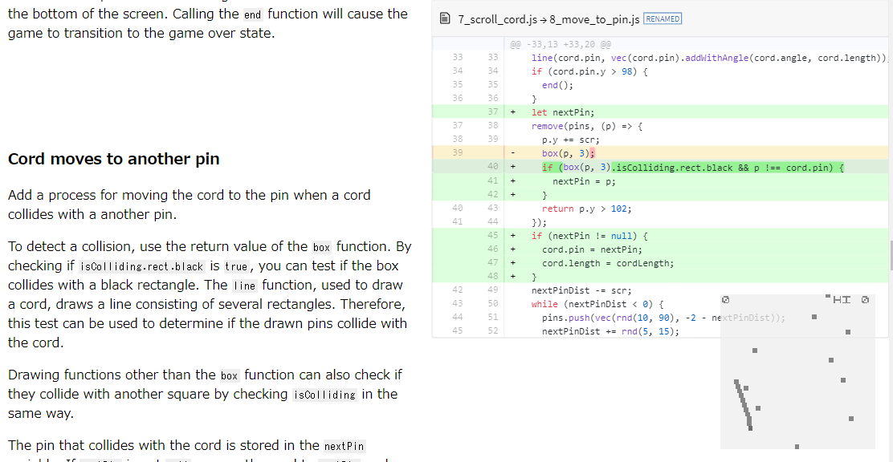

# literate-diff-viewer ([DEMO](https://abagames.github.io/literate-diff-viewer/pinclimb/))

Show source code description with literate diff way. Literate diff is a source code description method influenced by [Literate programming](https://en.wikipedia.org/wiki/Literate_programming) and [Literate commits](http://www.petecorey.com/blog/2016/07/11/literate-commits/).



### How to use literate-diff-viewer

- [Use for multiple source code files on the hosted server](https://abagames.github.io/literate-diff-viewer/literate-diff-viewer/).
- [Use for a committed source code file on GitHub](https://abagames.github.io/literate-diff-viewer/literate-diff-viewer-for-commits/).

### Reference

```ts
type SrcType = "show" | "hide" | "silent";

type SourceChangeEvent = {
  oldFileName: string;
  currentFileName: string;
  type: SrcType;
};

type Options = {
  readmeFileName?: string; // default: "./README.md"
  srcDirectoryName?: string; // default:  "./src/"
  isFetchingFromOtherHost?: boolean; // default: false
  onSourceChange?: (event: SourceChangeEvent) => void;
  postProcessSource?: (src: string) => string;
  storageKeyName?: string;
};

type SourceFileNameElement = {
  element: HTMLElement;
  fileName: string;
  srcText: string;
  type: SrcType;
};

async function init(_options: Options = {}): Promise<{
  markdownDiv: HTMLDivElement;
  sourceFileNameElements: SourceFileNameElement[];
}>;

function start();
```
